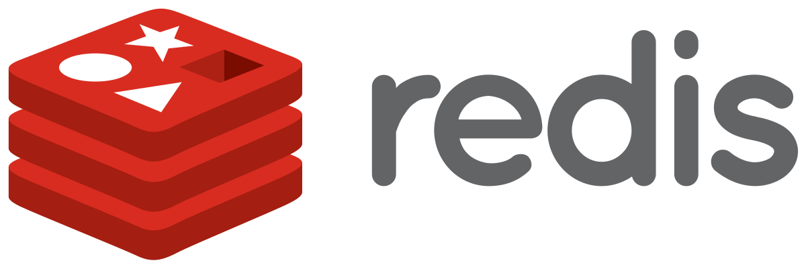

# Top Secret CIA Database

&nbsp;&nbsp;&nbsp;&nbsp;

## Features

> Using Laravel, PostgreSQL, and Redis, implemented a system that allows filtering the attached dataset by person's birth year, or birth month. or both.
> 
> Matching results cached in Redis for 60 seconds. Following requests for the same combination of filtering parameters (birth year, birth month) not query database before cache expires. 
> 
> If user changes filter parameters, Redis cache for old results can invalidated.
> 
> Displaying the users in a paginated table, with 20 rows per page. Pagination retrieved data from Redis cache if it is available.
> 
> Yes, Page number must not part of cache key. Instead, all rows from database that match filtering criteria (month, year) stored in Redis, and pagination retrieved only the required rows from Redis.

## Local Installation

Clone the repository in your local machine using `git clone https://github.com/razibalmamun/top-secret-cia.git`

### Requirements for Local Environment

-   [x] PHP Version 7.4 | 8.1
-   [x] PostgreSQL Version 13.2-2
-   [x] Redis Server Version 3.0.504

### Redis on Laragon
Redis is no longer supported in Windows, but the version 3.2.1 is still available to use [(ref)](https://redis.com/blog/redis-on-windows-8-1-and-previous-versions/#:~:text=Officially%2C%20Redis%20is%20not%20supported,ported%20to%20Windows%20by%20MSOpenTech.), so that's why laragon contain version 3.* only.
So, if you using Laragon you can follow this link to install `Redis` --> [Redis on Laragon](https://dev.to/dendihandian/installing-php-redis-extension-on-laragon-2mp3)

### Adding PostgreSQL to Laragon
You can find any version you want to install at [enterprisedb.com/download-postgresql-binaries](https://www.enterprisedb.com/download-postgresql-binaries) and make sure it support your windows machine. So, if you using Laragon you can follow this link to install `PostgreSQL` --> [PostgreSQL on Laragon](https://dev.to/dendihandian/adding-postgresql-to-laragon-2kde)

### Running the Application

1.  Open terminal/command promt from inside the `project folder` folder
2.  run command `cp .env.example .env`
3.  update `.env` file database informations according to your local machine.
4.  run command `composer install`
5.  run command `php artisan migrate`
8.  run command `php artisan serve`
9.  ready to browse. Just open your browser and enter to `http://localhost:8000`

### Import Customer Data From CSV to PostgreSQL
You can find `test-data\test-data.csv` csv file from inside the `project folder`. Then you can run `SQL Shell (psql)` or login your `PostgreSQL`. To connect using database then right click on database name. Now you can click `PSQL Tool`. After click `PSQL Tool` in right your side will open terminal to write sql command.

For example my `test-data.csv` file location is `C:\Users\User\Downloads\test-data.csv`. So run bellow command on your terminal.

`COPY customers (id, email, name, birthday, phone, ip, country) FROM 'C:\Users\User\Downloads\test-data.csv' DELIMITER ',' CSV HEADER;`

## Development Features
-   Laravel part
    -   Developed following **SOLID** _Principles_    
    -   Seperate **Form Request** classes for filter form
    -   Followed **Service** _Pattern_ where application
-   Used PostgreSQL
-   Used Redis
-   Unit Testing implemented. run command `php artisan test` 
